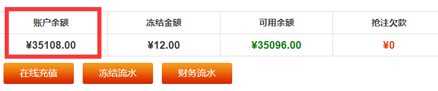

# interview-jumingkeji
聚名科技笔试题

### 需求 1 ：模拟抓取
自行注册账号，模拟登陆 `https://www.chengmi.cn` , 并获取账户余额。  

### 需求 2 ：域名注册
自行研究域名注册流程，实现域名注册功能。  
其中需要用到的各种 `api` , 例如：域名注册状态，提交域名注册。自行模拟返回即可。  
考验学习能力，业务分析能力。

### 需求 3 ：域名品相分析
分析域名是否 数字 字母 拼音 几拼 杂米。
如果不懂域名品相，可以到 `http://www.wanmi.cc/wm/` 玩米网上查看。

> 注意 ：
> 1. 请使用原生代码写，不要使用 `ThinkPHP` 等框架。在不影响需求实现的前提下，实现的代码文件越少越好，
     代码越精简越好。不要使用 `composer`。
>
> 
> 2. 域名注册接口：  
     `https://help.aliyun.com/document_detail/42875.html?spm=5176.10609282.905295.30.6a8c3801SNHxGM`

   